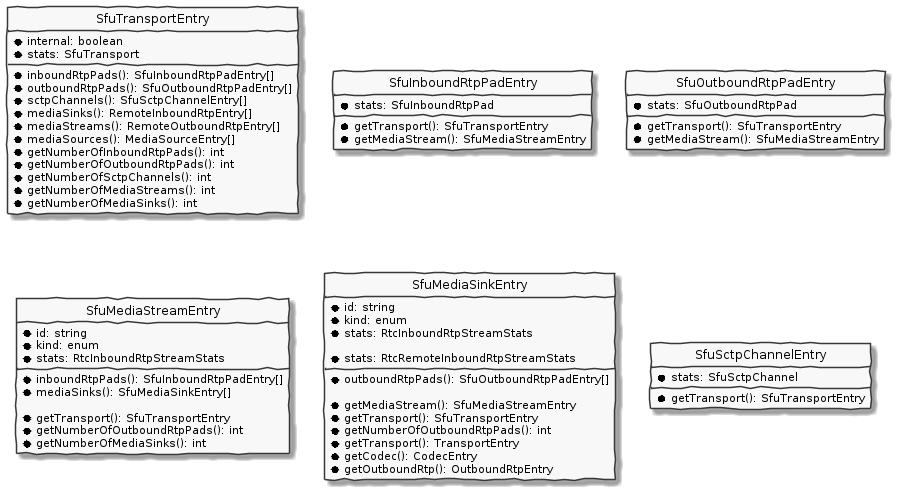

## Javascript library to monitor Selective Forwarding Units (SFU)

`@observertc/sfu-monitor-js` is javascript library to monitor your SFU and integrate with ObserveRTC.

Table of Contents:

-   [Quick Start](#quick-start)
    -   [Integrate Mediasoup](#integrate-mediasoup)
    -   [Integrate other type of SFUs](#integrate-other-type-of-sfus)
-   [Sfu Monitor Storage](#sfu-monitor-storage)
-   [Configurations](#configurations)
-   [API docs](#api-docs)
-   [NPM package](#npm-package)
-   [Schemas](#schemas)
-   [Getting Involved](#getting-involved)
-   [License](#license)

## Qucik Start

Install the library by using NPM:

```
npm i @observertc/sfu-monitor-js
```

Once the library is installed, you need to integrate it.
The first step is to setup a monitor in your application.

```javascript
import { SfuMonitor } from "@observertc/sfu-monitor-js";
// see full config in Configuration section
const config = {
    collectingPeriodInMs: 5000,
    samplingPeriodInMs: 10000,
    sendingPeriodInMs: 10000,
    sender: {
        websocket: {
            urls: ["ws://localhost:7080/samples/myServiceId/myMediaUnitId"],
        },
    },
};
const monitor = SfuMonitor.create(config);
```

A monitor does three things: 1. Collect Stats 2. Make sample based on the collected stats 3. Send the sample to the [observer](https://github.com/ObserveRTC/observer)

### Integrate Mediasoup

To integrate [mediasoup:3^](https://mediasoup.org/documentation/v3/) you can use the built-in MediasoupCollector.

```javascript
import mediasoup from "mediasoup";
import { createMediasoupMonitor } from "@observertc/sfu-monitor-js";

const monitor = createMediasoupMonitor({
    collectingPeriodInMs: 5000,
    mediasoup,
});
```

With this configuration the monitor automatically add and remove mediasoup objects. 

```javascript
monitor.events.onStatsCollected(() => {
    const storage = monitor.storage
    console.log(`Mediasoup SFU has ${storage.getNumberOfInboundRtpPads()} incoming RTP stream`);
    console.log(`Mediasoup SFU has ${storage.getNumberOfOutboundRtpPads()} outgoing RTP stream`);
    console.log(`Mediasoup SFU has ${storage.getNumberOfAudioSinks()} audio consumers`);
    console.log(`Mediasoup SFU has ${storage.getNumberOfVideoSinks()} video consumers`);
    console.log(`Mediasoup SFU has ${storage.getNumberOfMediaSinks()} consumers`);
    console.log(`Mediasoup SFU has ${storage.getNumberOfAudioStreams()} audio producers`);
    console.log(`Mediasoup SFU has ${storage.getNumberOfVideoStreams()} video producers`);
    console.log(`Mediasoup SFU has ${storage.getNumberOfMediaStreams()} producers`);
    console.log(`Mediasoup SFU has ${storage.getNumberOfTransports()} transports`);

    for (const audioSink of storage.audioSinks()) {
        console.log(`audio consumer ${audioSink.id} belongs to transport ${audioSink.getTransport()?.id} has the following outbound RTP stats`);
        for (const outboundRtp of audioSink.outboundRtpPads()) {
            console.log(`RTP Pad: ${outboundRtp.id}`, outboundRtp.stats);
        }
    }
});
```

By default it does not call `getStats` as it turned out to be performance intensive in some cases. 
If you want the collector to call the getStats on objects you can change the configuration like:

```javascript
const monitor = createMediasoupMonitor({
    collectingPeriodInMs: 5000,
    mediasoup,
    mediasoupCollector: {
        pollWebRtcTransportStats: (transportId) => true,
        pollPlainRtpTransportStats: (transportId) => true,
        pollPipeTransportStats: (transportId) => true,
        pollDirectTransportStats: (transportId) => true,
        pollProducerStats: (producerId) => true,
        pollConsumerStats: (consumerId) => true,
        pollDataProducerStats: (dataProducerId) => true,
        pollDataConsumerStats: (dataProducerId) => true,
    }
});
```

### Integrate other type of SFUs

To have a custom integration you could use `AuxCollector` as follows:

```javascript
import { AuxCollector } from "@observertc/sfu-monitor-js";

const collector = AuxCollector.create();
monitor.addStatsCollector(collector);

const transportId = "myUniqueGeneratedTransportId"
collector.addTransportStatsSupplier(transportId, async () => {
    const stats: SfuTransport = {

    };
    return stats;
});
// when you want to remove it:
collector.removeTransportStatsSupplier(transportId);

// similarly:
collector.addInboundRtpPadStatsSupplier("padId", ...);
collector.removeInboundRtpPadStatsSupplier("padId");

collector.addOutboundRtpPadStatsSupplier("padId", ...);
collector.removeOutboundRtpPadStatsSupplier("padId");

collector.addSctpStreamStatsSupplier("channelId", ...);
collector.removeSctpStreamSupplier("channelId");
```

## Sfu Monitor Storage

Sfu Monitor collects measurements about the following components:

-   **Transport**: Represent a network transport connection between an SFU and an external endpoint
-   **Inbound RTP Pad**: Represents an ingress point for RTP sessions to the SFU.
-   **Outbound RTP Pad**: Represents an eggress point for RTP sessions from the SFU.
-   **Media Stream**: Represent a group of inbound RTP pads belong to the same outbound media track
-   **Media Sink**: Represent a group of outbound RTP pads belong to the same inbound media track
-   **SCTP Channel**: Represent an SCTP session

Sfu Monitor Storage provided entries can be used to navigate from one collected components to another.



Entries:

-   [Transport](#transport-entries)
-   [Inbound RTP](#inbound-rtp-entries)
-   [Outbound RTP](#outbound-rtp-entries)
-   [Media Stream](#media-stream-entries)
-   [Media Sink](#media-sink-entries)
-   [SCTP Channel](#sctp-channel-entries)

### Transport Entries

```javascript
const storage = monitor.storage;
for (const transport of storage.transports()) {
    console.log(`Transport (${transport.id}) stats:`, transport.stats);

    for (const inboundRtpPad of transport.inboundRtpPads()) {
        console.log(
            `Inbound Rtp Pad (${inboundRtpPad.id}) belongs to transport (${transport.id}) stats:`,
            inboundRtpPad.stats
        );
    }
    for (const outboundRtpPad of transport.outboundRtpPads()) {
        console.log(
            `Outbound Rtp Pad (${outboundRtpPad.id}) belongs to transport (${transport.id}) stats:`,
            outboundRtpPad.stats
        );
    }
    for (const sctpChannel of transport.sctpChannels()) {
        console.log(
            `SCTP channel (${sctpChannel.id}) belongs to transport (${transport.id}) stats:`,
            sctpChannel.stats
        );
    }
    for (const mediaSink of transport.mediaSinks()) {
        console.log(`Transport (${transport.id}) has a ${mediaSink.kind} 
            sink having ${mediaSink.getNumberOfOutboundRtpPads()} outbound Rtp pads`);
    }
    for (const mediaStream of transport.mediaStreams()) {
        console.log(`Transport (${transport.id}) has a ${mediaStream.kind} 
            sink having ${mediaStream.getNumberOfInboundRtpPads()} inbound Rtp pads`);
    }
}
```

### Inbound RTP Entries

```javascript
for (const inboundRtpPad of storage.inboundRtpPads()) {
    // the transport the inbound rtp pad belongs to
    const transport = inboundRtpPad.getTransport();
    // the media stream the inbound rtp pad belongs to
    const mediaStream = inboundRtpPad.getMediaStream();
}
```

### Outbound RTP Entries

```javascript
for (const outboundRtpPad of storage.outboundRtpPads()) {
    // the transport the outbound rtp pad belongs to
    const transport = outboundRtpPad.getTransport();

    // the media stream the outbound rtp pad belongs to
    const mediaStream = outboundRtpPad.getMediaStream();

    // the media sink the outbound rtp pad belongs to
    const mediaSInk = outboundRtpPad.getMediaSink();
}
```

### Media Stream Entries

```javascript
for (const mediaStream of storage.mediaStreams()) {
    // the transport the media stream belongs to
    const transport = mediaStream.getTransport();

    for (const inboundRtpPad of mediaStream.inboundRtpPads()) {
        console.log(
            `Inbound Rtp Pad (${inboundRtpPad.id}) belongs to media stream (${mediaStream.id}) stats:`,
            inboundRtpPad.stats
        );
    }
    for (const mediaSink of mediaStream.mediaSinks()) {
        console.log(`Media stream (${mediaStream.id}) has a ${mediaSink.kind} 
            sink having ${mediaSink.getNumberOfOutboundRtpPads()} outbound Rtp pads`);
    }
}
```

### Media Sink Entries

```javascript
for (const mediaSink of storage.mediaSinks()) {
    // the transport the media stream belongs to
    const transport = mediaSink.getTransport();

    // the media stream the media sink belongs to
    const mediaStream = mediaSink.getMediaSink();

    for (const outboundRtpPad of mediaSink.outboundRtpPads()) {
        console.log(
            `Outbound Rtp Pad (${outboundRtpPad.id}) belongs to media stream (${mediaSink.id}) stats:`,
            outboundRtpPad.stats
        );
    }
}
```

### SCTP Channel Entries

```javascript
for (const sctpChannel of storage.sctpChannels()) {
    // the transport the sctp channel belongs to
    const transport = sctpChannel.getTransport();
}
```

## Configurations

```javascript
const config = {
    /**
     * By setting it, the monitor calls the added statsCollectors periodically
     * and polls the stats.
     *
     * DEFAULT: undefined
     */
    collectingPeriodInMs: 5000,
    /**
     * By setting it, the monitor make samples periodically.
     *
     * DEFAULT: undefined
     */
    samplingPeriodInMs: 10000,

    /**
     * By setting it stats items and entries are deleted if they are not updated.
     *
     * DEFAULT: undefined
     */
    statsExpirationTimeInMs: 60000,

    /**
     * Sampling Component Related configurations
     *
     */
    sampler: {
            /**
         * The identifier of the SFU.
         *
         * DEFAULT: a generated unique value
         */
        sfuId: "sfuId",

        /**
         * Indicate if the sampler only sample stats updated since the last sampling.
         *
         * DEFAULT: true
         */
        incrementalSampling: true,
    },
    sender: {
        /**
         * Configure the codec used to transport samples or receieve
         * feedback from the server.
         *
         * Possible values: json, protobuf
         *
         * DEFAULT: json
         *
         */
        format: "json",
        /**
         * Websocket configuration to transport the samples
         */
        websocket: {
            /**
             * The target urls the websocket is opened for
             */
            urls: ["ws://localhost:7080/samples/myServiceId/myMediaUnitId"],
            /**
             * The maximum number of try to connect to the server
             *
             * DEFAULT: 3
             */
            maxRetry: 1,
            /**
             * An optional field for additional socket option from ws package
             */
            socketOptions: {

            },
        },
        /**
         * Configuration to setup a REST api transport method for the samples.
         */
        rest: {
            /**
             * The target url the websocket is opened for
             */
            urls: ["http://localhost:7080/rest/samples/myServiceId/myMediaUnitId"];
            /**
             * The maximum number of try to connect to the server
             *
             * DEFAULT: 3
             */
            maxRetry: 1,
        },
    }
};
```

## API docs

https://observertc.github.io/sfu-monitor-js/interfaces/SfuMonitor.html

## NPM package

https://www.npmjs.com/package/@observertc/sfu-monitor-js

## Schemas

https://github.com/observertc/schemas

## Getting Involved

Sfu-monitor is made with the intention to provide an open-source monitoring solution for
WebRTC developers. We develop new features and maintaining the current
product with the help of the community. If you are interested in getting involved
please read our [contribution](CONTRIBUTING.md) guideline.

## License

Apache-2.0
