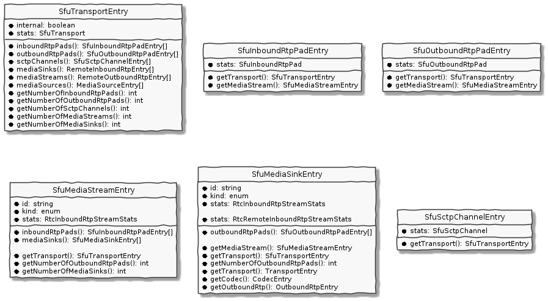

ObserveRTC Client Integration Core Library
---

# !!! UNDER DEVELOPMENT, NO STABLE VERSION IS AVAILABLE AT THE MOMENT! !!!

@observertc/sfu-observer-js is an SFU side library for observertc integration.

## Qucik Start

```
npm i @observertc/sfu-observer-js
```

### Collect stats from mediasoup

If you use [mediasoup:3.x.y]() you can use the built-in integration.

```javascript
import { SfuObserver, MediasoupCollector } from "@observertc/sfu-observer-js";
// see full config in Configuration section
const config = {
    collectingPeriodInMs: 5000,
};
const observer = SfuObserver.create(config);
const collector = MediasoupCollector.create();
observer.addStatsCollector(collector);

// ... somewhere in your code
const transport = router.createWebRtcTransport(options);
collector.watchWebRtcTransport(transport);
```

## Custom Stats Collecting

You can write a stats collector by using `AuxCollector`.
```javascript
import { SfuObserver, AuxCollector } from "@observertc/sfu-observer-js";
// see full config in Configuration section
const config = {
    collectingPeriodInMs: 5000,
};
const observer = SfuObserver.create(config);
const collector = AuxCollector.create();
observer.addStatsCollector(collector);

collector.addTransportStatsSupplier("transportId", async () => {
    const stats: SfuTransport = {

    };
    return stats;
});
collector.removeTransportStatsSupplier("transportId");

// similarly:
collector.addInboundRtpPadStatsSupplier("padId", ...);
collector.removeInboundRtpPadStatsSupplier("padId");

collector.addOutboundRtpPadStatsSupplier("padId", ...);
collector.removeOutboundRtpPadStatsSupplier("padId");

collector.addSctpStreamStatsSupplier("channelId", ...);
collector.removeSctpStreamSupplier("channelId");
```

## Use collected stats

```javascript
for (const sfuTransportEntry of observer.stats.transports()) {
    // use SfuTransportEntry
}

for (const sfuInboundRtpPadEntry of observer.stats.inboundRtpPads()) {
    // use SfuInboundRtpPadEntry
}

for (const sfuOutboundRtpPadEntry of observer.stats.outboundRtpPads()) {
    // use SfuInboundRtpPadEntry
}

for (const sctpChannelEntry of observer.stats.sctpChannels()) {
    // use SctpChannelEntry
}

for (const mediaStreamEntry of observer.stats.mediaStreams()) {
    // use MediaStreamEntry
}

for (const mediaStreamEntry of observer.stats.audioStreams()) {
    // use MediaStreamEntry
}

for (const mediaStreamEntry of observer.stats.videoStreams()) {
    // use MediaStreamEntry
}

for (const mediaSinkEntry of observer.stats.mediaSinks()) {
    // use MediaSinkEntry
}

for (const mediaSinkEntry of observer.stats.audioSinks()) {
    // use MediaSinkEntry
}

for (const mediaSinkEntry of observer.stats.videoSinks()) {
    // use MediaSinkEntry
}
```


With `observer.stats` you accessing so called Entries. The interface for the entries visualized in the picture below:




The collected stats from any integration is stored and updated in the 
observer object. The list of collected types are the following:
  * [SfuTransport](https://www.npmjs.com/package/@observertc/schemas#SfuTransport): A Transport level measurements provide data exchange for many inbound, outbound rtp pads, and sctp channels.
 * [SfuInboundRtpPad](https://www.npmjs.com/package/@observertc/schemas#SfuInboundRtpPad): Inbound Rtp Pad provided measurements. This is related to a client side provided [OutboundAudioTrack](https://www.npmjs.com/package/@observertc/schemas#OutboundAudioTrack), or [OutboundVideoTrack](https://www.npmjs.com/package/@observertc/schemas#OutboundVideoTrack) measurements.
  * [SfuOutboundRtpPad](https://www.npmjs.com/package/@observertc/schemas#SfuOutboundRtpPad): Outbound Rtp Pad (each pad relates to one ssrc) provided measurements. This is related to a client side provided [InboundAudioTrack](https://www.npmjs.com/package/@observertc/schemas#InboundAudioTrack), or [InboundVideoTrack](https://www.npmjs.com/package/@observertc/schemas#InboundVideoTrack) measurements.
 * [SfuSctpChannel](https://www.npmjs.com/package/@observertc/schemas#SfuSctpChannel): SCTP channel provided measurements

Additionally the observer groups the collected stats into the following entities:
 * **MediaStream**: a group of InboundRtpPad belongs to the same streamed media traffic. For example a simulcast media typically creates several SSRCs to stream the same media in different spatial or temporal aspective. Thos RTP sessions belong to the same media stream.
 * **MediaSink** A group of OutboundRtpPad sinks out media stream traffic to (typically) a client endpoint or to another SFU.
 

### Sample & Send

UNDER DEVELOPMENT

## Configurations

### Observer Configuration
```javascript
const config = {
    /**
     * By setting it, the observer calls the added statsCollectors periodically
     * and pulls the stats.
     * 
     * DEFAULT: undefined
     */
    collectingPeriodInMs: 5000,
    /**
     * By setting it, the observer make samples periodically.
     * 
     * DEFAULT: undefined
     */
    samplingPeriodInMs: 10000,

    /**
     * By setting it stats items and entries are deleted if they are not updated.
     * 
     * DEFAULT: undefined
     */
    statsExpirationTimeInMs: 60000,

    /**
     * Sampling Component Related configurations
     * 
     */
    sampler: {
            /**
         * The identifier of the SFU.
         * 
         * DEFAULT: a generated unique value
         */
        sfuId: "sfuId",

        /**
         * Indicate if the sampler only sample stats updated since the last sampling.
         * 
         * DEFAULT: true
         */
        incrementalSampling: true,
    },
};
```

